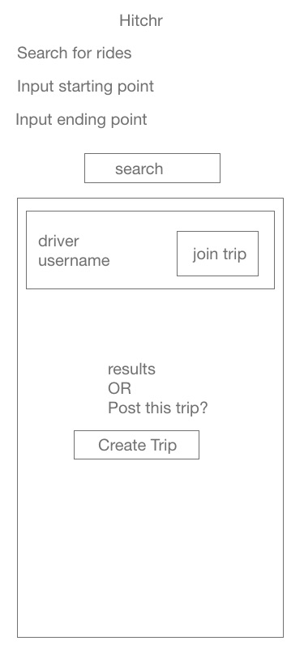
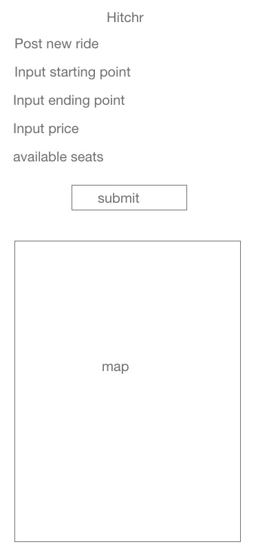
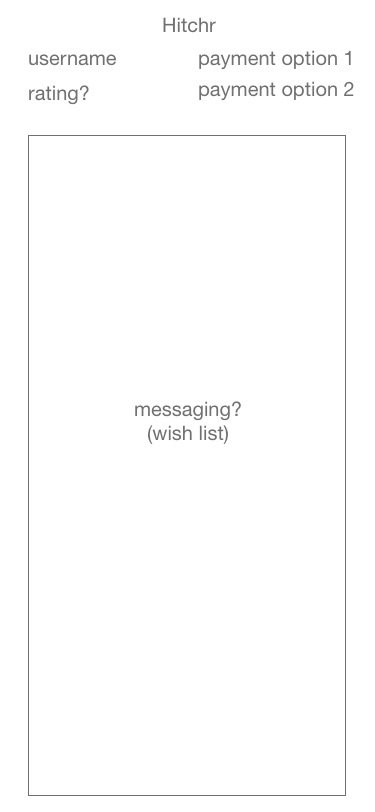
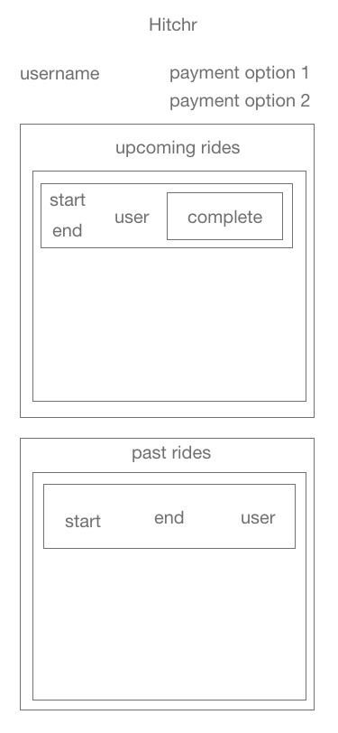
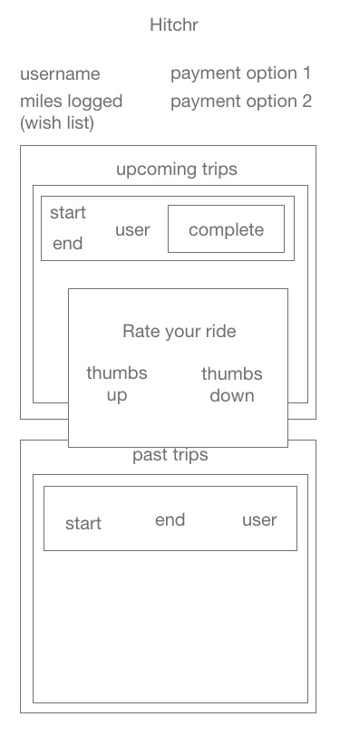
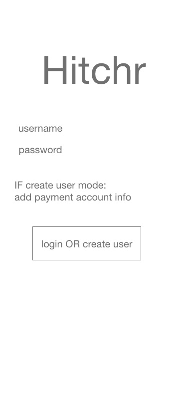

# "Hitchr" Client - The Creative Otters

## Background

*Hitchr* is a full-stack assignment for the Hack Reactor software engineering immersive program.

This repo contains the *Hitchr* _**client**_ app for **The Creative Otters**, a team consisting of the following developers:

- Randall Stanford - *Product Manager & Software Engineer*
- Trevor Settles - *Architecture Owner & Software Engineer*
- Sam Pool - *UI Owner & Software Engineer*
- Cade Kreikemeier - *Software Engineer*
- Yunfan Gao - *Software Engineer*

The _**backend**_ of this fullstack app can be found in a **[different repo](https://github.com/The-Creative-Beavers/hitchr-backend)**. All details laid out in this repo are in regards to the **client app** specifically.

These five developers were given roughly 1.5 weeks to build out a fullstack web application from scratch according to a rough concept from a mock client.

---

## The Concept

***Hitchr*** is a fullstack web app that allows users to post drives they will be taking (_i.e. a specific starting destination and ending destination_) so that other users can search for rides they wish to take and find posted trips that match their search.

The ultimate goal of _Hitchr_ is to reduce car traffic by allowing users to rideshare for long drives.

---

## Primary Technologies

This project's client app was built using the following primary technologies

- **ReactJS**
    - Frontend javascript framework used to build the user interface.
- **React Router**
    - Complementary library to ReactJS responsible for conditionally rendering the app's views based on the current URL.
- **Babel**
    - Transpilation package used to convert ReactJS-specific syntax into browser-consumable JavaScript.
- **Webpack**
    - Bundling package used to bundle javascript modules and component-focused stylesheets into ```.js``` and ```.css``` bundles for browser comsumption.
- **Jest + React-Testing-Library**
    - Testing framework and library used for unit tests, integration tests, and end-to-end tests.

---

## Installation

Steps for getting started as a developer on this repo:

1. Clone this repo onto your local machine:
    - ```git clone https://github.com/The-Creative-Beavers/hitchr-frontend.git```
2. ```cd``` into the repo's root directory
3. Install the project's depencies:
    - ```npm install```
4. Start developing!

---

## Provided Scripts

- ```npm run dev-build```
    - bundles the contents of the ```src/``` directory (also transpiling JavaScript as needed for browser consumption) into bundled ```.js``` and ```.css``` files which are linked into the ```index.html``` page, then __watches for changes and re-bundles on each file change.__
- ```npm run server```
    - starts a development server which serves the client app from localhost - by default on ```localhost:3000``` - then __watches for changes and restarts the server with updated content on each file change__.
- ```npm run build```
    - builds the app for production - __does not watch for files changes__.
- ```npm run start```
    - runs the app in production mode - __does not watch for file changes__.
- ```npm run test```
    - runs the app's full test suite via **Jest**, automatically running all files with a `.test.jsx` or `test.js` file extension.
    - _**NOTE:**_ This repo's GitHub origin will not merge any updates that cause the included tests to fail.
- ```npm run lint```
    - runs **eslint** on the full repo to check for syntax errors of code-style violations. This repo ueses the **AirBnB Style Guide**
    - _**NOTE:**_ This repo's GitHub origin will not merge any updates that do not the linter.

---

## Project Structure


- ```client/```
    - files related to the ReactJS client application
    - ```dist/```
        - static bundled and transpiled files to be served as the client application
    - ```src/```
        - source files for the client application
        - ```views/```
            - ReactJS component files (```.jsx```) for the client app's different views (i.e. **RideSearch** view, **Dashboard** view, etc) and their associated style sheets (```.css```) and jest test suites (```.test.js```), organized by component. All the sub-components of these views are located in the components folder (see below)
        - ```components/```
            - ReactJS component files (```.jsx```) and their associated style sheets (```.css```) and jest test suites (```.test.js```), organized by component.
        - ```dummyData/```
            - data matching the shape and content returned from (or posted to) the various API calls for use in development and testing.
        - ```App.jsx```
            - The parent client application component which renders all child components.
        - ```App.test.jsx```
            - tests for the parent app component - the bulk of the app's tests are dispersed throughout the ```components/``` directory structure, organized by the component they test.
        - ```index.js```
            - the root JavaScript file of the webpack bundle - imports the ```App.jsx``` file and injects it into the ```/client/dist/index.html``` page.
        - ```serverUtils.js```
            - This file contains all functions interacting with the API server - i.e. all HTTP requests. All components with functions or methods requiring HTTP requests will call the appropriate method from this file.

- ```server/```
    - files for the minimal ExpressJS server responsible for serving the client app (This project's API server exists in a **[different repo](https://github.com/The-Creative-Beavers/hitchr-backend)**)


- etc...
    - config files for webpack, babel, jest, etc

---

## Views

Since this is a Single-Page-Application (SPA), different views are rendered to the user via React Router logic instead of our backend serving different HTML pages.

This section describes each of the app's views.

Below are the wireframe designs for each View:


| `RideSearch` | `CreateRide` | `User` |
|-|-|-|
||||
| **`Dashboard`** | **`Dashboard`** (w/ review modal) | **`Auth`** |
|||

---

### `RideSearch`

The `RideSearch` view allows users to input a starting city and ending city and see any posted rides matching their search inputs.

#### **Child Components:**
- `RideList` ***(shared)***
  - Responsible for rendering the results of `RideSearch`'s query.
  - For each search result, `RideList` renders a `RideItem` child-component.
    - `RideItem`
      - renders the relevant info (_username, etc_) for each ride result

---

### `CreateRide`

This view provides the user inputs necessary to post a new ride.

---

### `Dashboard`

The `Dashboard` view shows relevant info about the currently logged in user. This info includes their username, payment methods, and saved trips.

A **stretch goal** for this view is a feature for marking trips as complete, then allowing the user to rate the driver / other passengers from this ride.

#### **Child Components:**
- `PayMethodList` ***(shared)***
  - This component is shared by multiple views and is responsible for rendering each payment method associated with a particular user.
    - `PayMethod`
      - This component is rendered by `PayMethodList` and renders a single payment method (e.g. Venmo or Paypal etc) for a user's list of payment methods. This component renders an `<a>` link to the relevant account (e.g. their paypal URL etc) which is displayed as the name of the provider.
- `UpcomingTrips`
  - Renders a `RideList` component for a user's upcoming rides.
  - `RideList` ***(shared)***
    - Responsible for rendering the users trips which aren't marked as complete.
    - For each upcoming ride, `RideList` renders a `RideItem` child-component.
        - `RideItem`
        - renders the relevant info (_username, etc_) for each ride result
- `PastTrips`
  - Renders a `RideList` component for a user's completed rides.
  - `RideList` ***(shared)***
    - Responsible for rendering the users trips which aren't marked as complete.
    - For each upcoming ride, `RideList` renders a `RideItem` child-component.
        - `RideItem`
          - renders the relevant info (_username, etc_) for each ride result

___

### User

Renders user info for a specific user, as well as the currently logged in user's message history with the specified user.

#### **Child Components:**
- `PayMethodList` ***(shared)***
  - This component is shared by multiple views and is responsible for rendering each payment method associated with the user.
    - `PayMethod`
      - This component is rendered by `PayMethodList` and renders a single payment method (e.g. Venmo or Paypal etc) for a user's list of payment methods. This component renders an `<a>` link to the relevant account (e.g. their paypal URL etc) which is displayed as the name of the provider.
- `MessageList`
  - Renders the message history between the current user and the user of the current profile. Renders each specific message via a `Message` component.
    - `Message`
      - Child of `MessagesList` - renders a single message from the list.
___

### Auth

This view facilitates user log in and account creation.

The default mode for this view is _Log In_ mode, which contains a link to switch the view into _New Account_ mode.

Any traffic not determined by the API server to have a valid session id associated will automatically be re-directed to this view.
